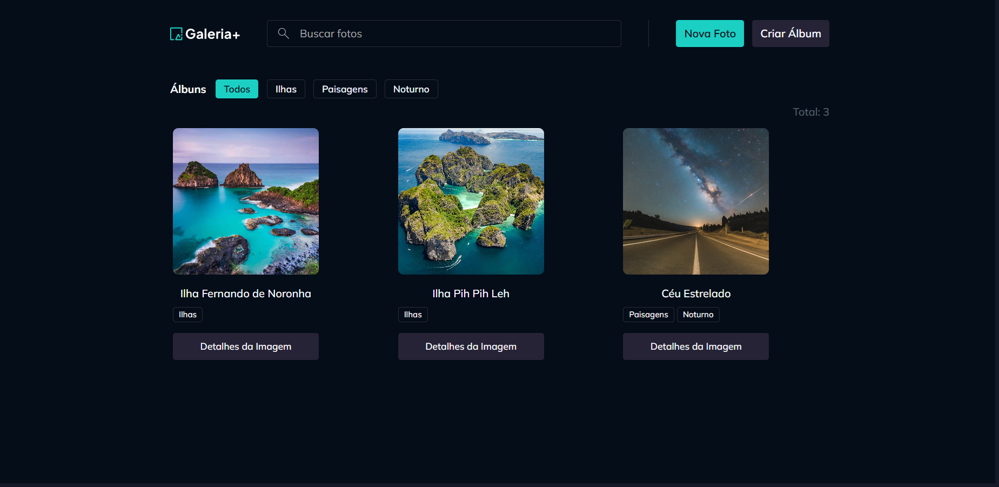
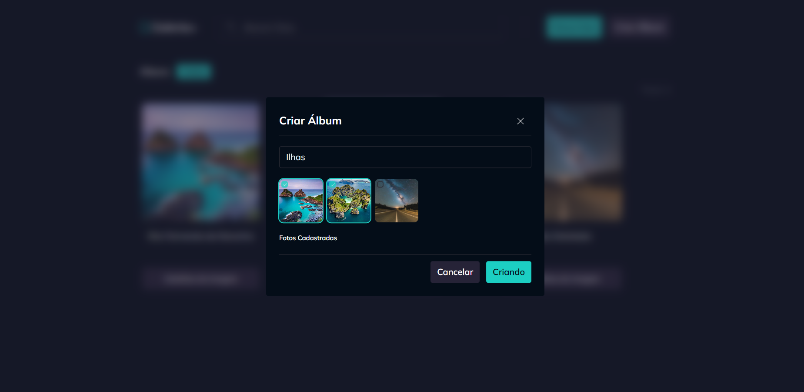
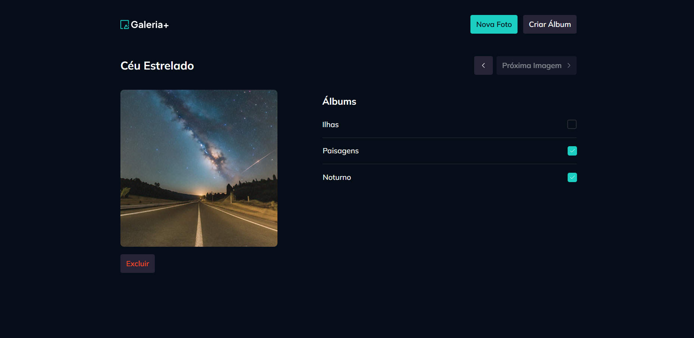

# Gallery Plus

Gallery Plus é uma aplicação web de galeria de imagens interativa. O projeto tem o objetivo de criar um projeto web com as melhores práticas de desenvolvimento web, utilizando as tecnologias mais modernas e atualizadas. Contando com backend robusto com Node.js e Fastify para o gerenciamento de dados e upload de arquivos.

## 📸 Demonstração


<hr>

<hr>

<hr>

<hr>

## ✨ Conceitos Aplicados

O frontend desta aplicação foi desenvolvido com foco em performance, escalabilidade e uma ótima experiência de desenvolvimento, aplicando os seguintes conceitos e tecnologias:

- **React com Vite**: Utilização do React para a construção de interfaces de usuário componentizadas e reativas, com o Vite proporcionando um ambiente de desenvolvimento extremamente rápido com Hot Module Replacement (HMR).

- **TypeScript**: Todo o código é tipado com TypeScript, garantindo maior segurança, legibilidade e facilidade na manutenção do código.

- **Gerenciamento de Estado com TanStack Query**: Para o gerenciamento de estado do servidor, o TanStack Query (React Query) é utilizado para realizar o fetching, caching, sincronização e atualização de dados de forma eficiente e declarativa.

- **Roteamento com React Router**: A navegação entre as páginas da aplicação é controlada pelo React Router, a biblioteca padrão da comunidade para roteamento em aplicações React.

- **Estilização com Tailwind CSS**: A estilização é feita com o framework utility-first Tailwind CSS, permitindo a criação de designs customizados de forma rápida e consistente. A biblioteca `tailwind-variants` é utilizada para criar componentes com variantes de estilo de forma organizada.

- **Formulários com React Hook Form e Zod**: Para a criação e validação de formulários, a aplicação utiliza a performance da biblioteca React Hook Form em conjunto com o Zod para a validação de schemas, garantindo que os dados enviados sejam consistentes e seguros.

- **Componentes Acessíveis com Radix UI**: Alguns componentes, como modais (`Dialog`), são construídos sobre o Radix UI, que fornece primitivas de UI acessíveis e não estilizadas, garantindo uma base sólida para a acessibilidade.

- **Requisições HTTP com Axios**: O Axios é o cliente HTTP utilizado para realizar as requisições à API do backend de forma simples e poderosa.

- **Notificações com Sonner**: Para feedbacks visuais, como mensagens de sucesso ou erro, a biblioteca Sonner é utilizada para exibir toasts elegantes e não intrusivos.

## 📏 Estrutura do Projeto

A estrutura de pastas do frontend (`src/`) foi organizada para promover a modularidade e a fácil localização dos arquivos:

```
src/
├── assets/ # Imagens, ícones e outros arquivos estáticos
├── components/ # Componentes React reutilizáveis
├── contexts/ # Provedores de Contexto do React
├── helpers/ # Funções utilitárias
├── pages/ # Componentes de página, usados pelo React Router
├── App.tsx # Componente principal que organiza as rotas
├── main.tsx # Ponto de entrada da aplicação React
└── index.css # Estilos globais
```

## 🚀 Como Executar o Projeto

Siga os passos abaixo para executar o projeto em seu ambiente de desenvolvimento.

### Pré-requisitos

- [Node.js](https://nodejs.org/) (versão 20.x ou superior)
- [pnpm](https://pnpm.io/) como gerenciador de pacotes

### Passos

1. **Clone o repositório:**
   ```bash
   git clone <URL_DO_REPOSITORIO>
   cd gallery-react
   ```

2. **Instale as dependências:**
   ```bash
   pnpm install
   ```

3. **Configure as variáveis de ambiente:**
   - Renomeie o arquivo `.env.example` (se houver) para `.env` e preencha as variáveis necessárias.

4. **Inicie o servidor do backend:**
   - Em um terminal, execute o comando para iniciar o servidor de desenvolvimento do backend. Ele ficará observando as alterações nos arquivos.
   ```bash
   pnpm dev-server
   ```

5. **Inicie o servidor do frontend:**
   - Em **outro terminal**, execute o comando para iniciar o servidor de desenvolvimento do frontend.
   ```bash
   pnpm dev
   ```

6. **Acesse a aplicação:**
   - Abra seu navegador e acesse [http://localhost:5173](http://localhost:5173) (ou a porta que for indicada no terminal).
